# Podcast Search with Gemini File Search API

This project is a simple command-line tool that demonstrates how to build a searchable podcast knowledge base using the [Gemini File Search API](https://ai.google.dev/gemini-api/docs/file-search).

It consists of two main scripts:
*   `ingest.py`: Ingests a podcast RSS feed, downloads audio, transcribes episodes using the fast Gemini 2.5 Flash-Lite model, and uploads them to a File Search Store.
*   `query.py`: Allows you to ask natural language questions about the ingested podcast content and receive grounded answers with citations.

```mermaid
---
config:
  themeVariables:
    fontFamily: monospace
    fontSize: 12px
  flowchart:
    wrappingWidth: 300
    subGraphTitleMargin:
      top: 5
      bottom: 10
  layout: elk
  look: handDrawn
---
flowchart LR
  Start("**📻 Podcast RSS Feed**") --> Ingest
  subgraph Ingest["**INGESTION PHASE** (ingest.py)"]
    direction TB
    Download("**Download Episodes**<br>• Audio files from RSS<br>• Last N episodes")
    Transcribe("**Transcribe Audio**<br>• Gemini 2.5 Flash-Lite<br>• Skip ads/promos<br>• Label speakers")
    Upload("**Upload to Store**<br>• Add custom metadata<br>• Title, podcast, tags<br>• Date range info")
    Download --> Transcribe
    Transcribe --> Upload
  end
  Ingest --> Store[(**File Search Store**<br>Managed RAG system)]
  Store --> Query
  subgraph Query["**QUERY PHASE** (query.py)"]
    direction TB
    Question("**User Question**<br>Natural language")
    Search("**File Search Tool**<br>• Optional metadata filters<br>• Automatic retrieval")
    Generate("**Gemini 2.5 Flash**<br>• Generate answer<br>• Include citations")
    Question --> Search
    Search --> Generate
  end
  Query --> Results("**✓ Results**<br>• Answer with context<br>• Episode citations<br>• Source verification")    
  classDef default text-align:left
```



## Prerequisites

*   Python 3.10+
*   A Gemini API key (get one from [Google AI Studio](https://aistudio.google.com/app/apikey)).

## Setup

1.  Create and activate a virtual environment:
    ```bash
    python3 -m venv .venv
    source .venv/bin/activate
    ```

1.  Install dependencies:
    ```bash
    pip install -r requirements.txt
    ```

1.  Create a `.env` file and add your API key:
    ```bash
    echo "GOOGLE_API_KEY=your_api_key_here" > .env
    ```

## Usage

### 1. Ingest a Podcast

Run `ingest.py` with the RSS feed URL of the podcast you want to index. You can use the `--limit` flag to restrict the number of episodes processed.

```bash
python ingest.py "https://feeds.example.com/podcast.rss" --limit 5
```

This will:
*   Create a new File Search Store named "Podcasts" (if it doesn't exist).
*   Download the specified number of recent episodes.
*   Transcribe them using Gemini 2.5 Flash-Lite.
*   Upload the transcripts, with metadata, to the store.

Optionally pass `--store "My store name"` to specify the File Store to use.

### 2. Ask a Question

Once ingestion is complete, use `query.py` to ask questions:

```bash
python query.py "What was the main topic discussed in the latest episode?"
```

Gemini will search the indexed transcripts and provide an answer based on the actual content, complete with citations.

